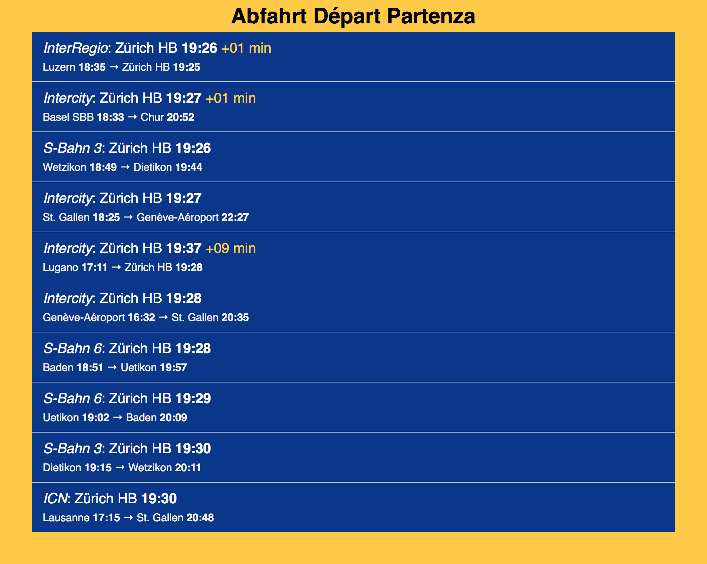

# chill

The Swiss public transport open-sourced timetables, station information and real-time data. 
I posed myself a challenge by building my own SBB-schedule as a website within one Saturday. 

This is the result. 

At the moment, I'm running a test instance on a spare laptop in my shared flat's living room. 
Since I live no 60 secs from the next station, it might be interesting to know any three minutes delay, especially in winter.

Chill opens up with a list of all Swiss stations provided by [Bahnhofsliste](https://opentransportdata.swiss/de/cookbook/bahnhofsliste/). 
After choosing a station, the website changes to an overview screen which presents the next trains leaving the station. 

## Project Structure

All "meta"-stuff can be found in the root directory (README, tests, license, etc.). 

Everything that belongs to the server is located in `www`. 

There's a `version` folder containing all versions of the website. The use of this depends on your workflow. For a small website, it's all right just to use git. The disadvantage for heavily used sites is, that at the moment of pulling the website is down. 

Another workflow could be to have different versions of the site in the versions folder while `latest` is a symbolic link to the production version. Updating to the website could then be a single atomic operation of repointing the symbolic link.

### Directories in a version

- `cache`: Cache for the website. Autogenerated.
- `config`: Version dependent configuration.
- `inc`: PHP-includes that are included by pages in `public`.
- `lib`: The site's library classes (modelling of the transport system, utility classes, …)
- `public`: Root of your web server. All requests should end up in this directory. All resources like scripts, stylesheets, scripts and images that should be accessed from the internet belong in here.
- `res`: Data-resources (list of stations, mock data).
- `singletons`: Objects that are used on all pages but always are the same.
- `templates`: Templates for TWIG to render HTML pages.
- `tmp`: Temporary folder. It can be deleted on a regular basis Autogenerated.
- `twig_cache`: Cache for twig templates.
- `vendor`: Repository for "composer".

## Set up
At some point, you need to fetch dependencies (twig, phpunit). 
There are two `composer.json` files, one in the root (for unit test environment). The other one in the web server root `www/versions/latest/` (for the template engine). Run the bash command `composer update;` in the corresponding directory at some point. If in doubt, do it first.

Load everything in `www` onto a server.

Point the server's root directory to `www/versions/latest/public/`.

To access trias, you need an API key from [opentransportdata.swiss](https://opentransportdata.swiss/de/dev-dashboard). Get one.

Copy the file `www/config/config_default.php` to `www/config/config.php` and add your key as value of `OPENTRANSPORTDATA_SWISS_API_KEY`.

Place `www/config/config.php` on the server. 
You can set `production` to `true` on the server and to `false` in your dev-environment (toggles error reporting, data-mocking, etc.).

That's it. There might be some errors while generating temporary folders, but that's environment dependent and should easily be solved by creating the folders and giving them the right access rights.

